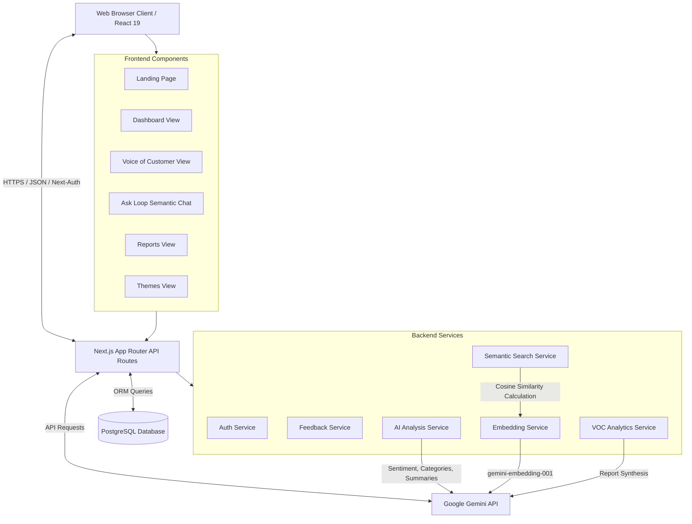
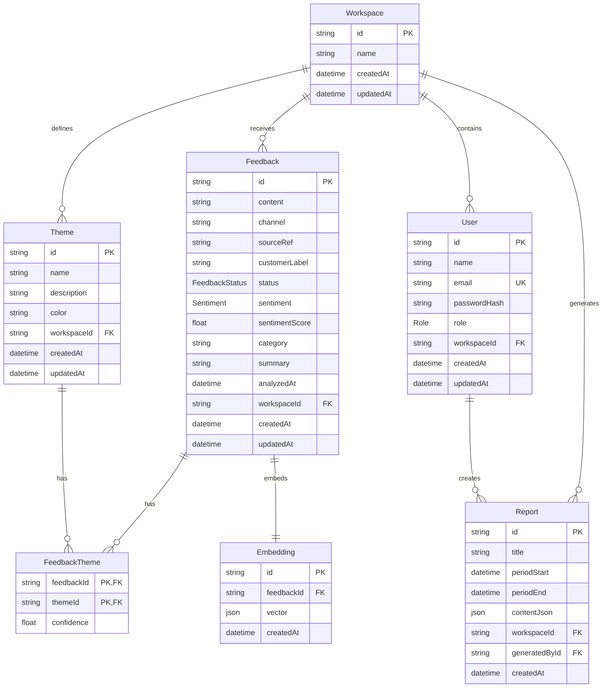
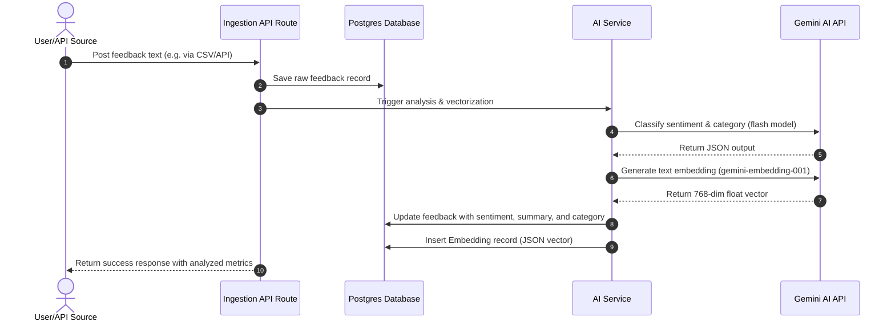

# LOOP AI - Customer Feedback Intelligence Platform
## Technical Project Documentation

---

### Executive Summary

**LOOP AI** is a state-of-the-art Customer Feedback Intelligence Platform designed to transform raw customer reviews, support logs, and survey responses into actionable, structured product insights. By leveraging semantic search engines and Google's Gemini models, LOOP AI eliminates the limitations of traditional keyword-based feedback filters, enabling teams to automatically categorize issues, classify sentiments, cluster thematic patterns, and generate periodic executive reports.

---

## 1. Project Overview

### 1.1 Problem Statement
Modern businesses receive customer feedback across a multitude of channels—mobile apps, web interfaces, support tickets, community forums, and email. Analyzing this data manually is slow, error-prone, and fails to scale. Furthermore, traditional search mechanisms rely on exact keyword matches, missing conceptually identical feedback (e.g., searching for "login issue" misses "can't access my profile page").

### 1.2 Core Features
*   **AI-Powered Categorization & Sentiment Analysis:** Automatic tag assignment (`Bug`, `Performance`, `UI`, `Pricing`, `Support`, `Feature Request`) and sentiment classification (`POS` for Positive, `NEU` for Neutral, `NEG` for Negative) upon feedback ingestion.
*   **Semantic Search & Chat ("Ask LOOP"):** A Vector database representation utilizing cosine similarity to locate conceptually related feedback and converse with feedback logs in natural language.
*   **Voice of the Customer (VOC) Synthesis:** High-level executive summaries, critical issue extraction, and actionable product recommendations generated dynamically via Gemini.
*   **Thematic Trend Grouping:** Grouping feedbacks into distinct themes (e.g., Billing, Security, UX) to trace impact scores.
*   **AI Executive PDF/CSV Reports:** On-demand generation and downloading of formatted report summaries containing metrics, volumes, and AI insights.

---

## 2. Technology Stack

LOOP AI is built on a robust, highly performant, type-safe stack:

| Layer | Technology | Version / Purpose |
| :--- | :--- | :--- |
| **Framework** | Next.js (App Router) | v16.2.10 — Server-side rendering, routing, & API endpoints |
| **Language** | TypeScript | v5.x — Strict typing and code reliability |
| **View Layer** | React | v19.2.4 — Component-based declarative UI |
| **Styling** | Tailwind CSS | v4.x — Next-generation utility-first styling |
| **ORM** | Prisma | v7.8.0 — Typesafe database queries and migrations |
| **Database** | PostgreSQL | Enterprise relational database storage |
| **Authentication** | NextAuth.js | v4.24 — Secure user sessions and role-based permissions |
| **AI Integration** | Google Gen AI SDK | `@google/genai` (Gemini-2.5-flash / Gemini-2.0-flash / Gemini-1.5-flash) |
| **Vector Search** | In-Memory Cosine | Embeddings computed via `gemini-embedding-001` and queried in TS |
| **Data Export** | PDF-lib & Papaparse | For generating customized PDF reports and CSV/JSON feeds |
| **Visualizations** | Chart.js & Framer Motion | Dynamic dashboard charts and smooth editorial micro-animations |

---

## 3. System Architecture & Diagrams

### 3.1 High-Level Architecture Diagram
The diagram below illustrates how requests flow from the frontend client to the API handlers, PostgreSQL database, and Google's Gemini models.



### 3.2 Database Schema (Entity-Relationship Diagram)
Our database is defined using Prisma. It models multi-tenant workspaces, user accounts with roles, feedback logs, themes, vector embeddings, and generated report history.



### 3.3 System Ingestion and Analysis Flow
This sequence diagram shows the step-by-step workflow of a new feedback log being processed, analyzed, vectorized, and stored.



---

## 4. Directory & Module Structure

The project code is organized as follows:

```
loop-ai-feedback/
├── app/                      # Next.js App Router root
│   ├── (auth)/               # Authentication routing (Login, Signup)
│   ├── (dashboard)/          # Secured Dashboard shell routes
│   │   ├── dashboard/        # Metrics charts & Insights overview
│   │   ├── feedback/         # Ingestion, filters, and list views
│   │   ├── reports/          # Report list & PDF exporter trigger
│   │   ├── voc/              # Voice of Customer report generation
│   │   ├── ask-loop/         # AI Chat console on top of embeddings
│   │   ├── themes/           # Thematic trend groups UI
│   │   └── settings/         # Workspace configurations
│   ├── actions/              # Server Actions for form submissions
│   ├── api/                  # Backend REST API routes
│   │   ├── export/           # PDF / CSV download endpoint handlers
│   │   └── dashboard/        # Metric calculation endpoints
│   ├── generated/            # Automatically generated Prisma types
│   ├── globals.css           # Global theme, Tailwind, custom Canva styles
│   └── page.tsx              # Landing Page layout
├── components/               # Reusable React components
│   ├── ui/                   # Reusable visual primitives (cards, tables)
│   └── layout/               # Sidebar, header shell elements
├── services/                 # Centralized Business Logic core layer
│   ├── ai.service.ts         # Gemini category, sentiment, & insights prompts
│   ├── embedding.service.ts  # Model API calls to generate vector values
│   ├── search.service.ts     # In-memory cosine similarity search
│   ├── voc.service.ts        # VOC Synthesis & Gemini recommendation logic
│   └── report.service.ts     # Custom report hooks
├── prisma/                   # Database configurations
│   ├── schema.prisma         # Active PostgreSQL DB schema definition
│   └── seed.ts               # Seed data generator for Demo accounts
└── package.json              # Project packages configuration
```

---

## 5. Core Implementation Details & Logic

### 5.1 AI-Powered Feedback Analysis
When a piece of feedback is ingested, it is evaluated by Gemini. Below is the orchestration logic implemented in [services/ai.service.ts](file:///c:/Users/navya%20sastry/OneDrive/Desktop/loop-ai/loop-ai-feedback/services/ai.service.ts) using fallback rules in case of network failures or API quotas:

```typescript
export async function analyzeFeedback(feedback: string) {
  const prompt = `
You are an AI assistant that analyzes customer feedback.
Return ONLY valid JSON.

Schema:
{
  "sentiment": "Positive | Neutral | Negative",
  "category": "UI | Performance | Bug | Feature Request | Pricing | Support | Other",
  "summary": "One sentence summary"
}

Feedback:
"${feedback}"
`;

  // Fail-safe logic in case Gemini API is offline/unreachable
  const mockAnalysis = () => {
    const lower = feedback.toLowerCase();
    let sentiment = "Neutral";
    if (/\b(love|great|awesome|amazing|good|happy)\b/.test(lower)) sentiment = "Positive";
    else if (/\b(bad|slow|crash|issue|bug|error|broken|fail)\b/.test(lower)) sentiment = "Negative";

    let category = "Other";
    if (/\b(slow|performance|delay|lag)\b/.test(lower)) category = "Performance";
    else if (/\b(ui|design|layout|button|style)\b/.test(lower)) category = "UI";
    else if (/\b(bug|crash|error|broke)\b/.test(lower)) category = "Bug";
    
    const summary = feedback.length > 60 ? feedback.substring(0, 57) + "..." : feedback;
    return { sentiment, category, summary };
  };

  const text = await generateContentWithFallback({
    contents: prompt,
    defaultMock: mockAnalysis,
  });

  const jsonStart = text.indexOf("{");
  const jsonEnd = text.lastIndexOf("}");
  const cleaned = text.slice(jsonStart, jsonEnd + 1);
  const analysis = JSON.parse(cleaned);

  let sentiment: "POS" | "NEU" | "NEG";
  switch (analysis.sentiment.toLowerCase()) {
    case "positive": sentiment = "POS"; break;
    case "negative": sentiment = "NEG"; break;
    default: sentiment = "NEU";
  }

  return { ...analysis, sentiment };
}
```

### 5.2 Embedding Service & Cosine Similarity Semantic Search
Instead of doing plain string matching, LOOP AI generates standard 768-dimension vector representations through `gemini-embedding-001` and filters records using the cosine similarity metric:

$$ \text{Similarity}(A, B) = \frac{A \cdot B}{\|A\| \|B\|} $$

Here is the implementation in [services/search.service.ts](file:///c:/Users/navya%20sastry/OneDrive/Desktop/loop-ai/loop-ai-feedback/services/search.service.ts):

```typescript
export async function semanticSearch(query: string, workspaceId: string, limit = 10) {
  // 1. Generate 768-dim embedding for user search query
  const queryVector = await generateEmbedding(query);

  // 2. Fetch all existing stored feedback embeddings in this workspace
  const embeddings = await prisma.embedding.findMany({
    where: { feedback: { workspaceId } },
    include: { feedback: true },
  });

  // 3. Compute in-memory cosine similarities
  const scored = embeddings
    .map((item) => ({
      feedback: item.feedback,
      score: cosineSimilarity(queryVector, item.vector as number[]),
    }))
    .filter((item) => item.score >= 0.5); // Filter relevance threshold

  // 4. Sort and return limit
  scored.sort((a, b) => b.score - a.score);
  return scored.slice(0, limit);
}
```

### 5.3 PDF Generation & Layout Engine
Reports are exported to PDF on the backend using `pdf-lib`. The layout script supports automatic text wrapping for multi-line insights, boundary checking, and custom multi-page insertion.

```typescript
// Custom wrapping utility to keep text bounds correct in standard font sizes
function wrapText(text: string, maxWidth: number, font: any, fontSize: number): string[] {
  const words = text.split(" ");
  const lines: string[] = [];
  let currentLine = "";

  for (const word of words) {
    const testLine = currentLine ? `${currentLine} ${word}` : word;
    const width = font.widthOfTextAtSize(testLine, fontSize);
    if (width > maxWidth) {
      lines.push(currentLine);
      currentLine = word;
    } else {
      currentLine = testLine;
    }
  }
  if (currentLine) lines.push(currentLine);
  return lines;
}
```

---

## 6. Page Architectures & UI Descriptions

### 6.1 Landing Page (`/`)
An elegant Canva-style presentation landing page introducing LOOP AI features:
*   **Hero Section:** Features high-impact typography ("Feedback Intelligence. Unbound.") and modern editorial animations.
*   **Interactive QA Console:** Allows prospective users to test the AI's semantic responses to user prompts.
*   **Realigned Call-To-Action Card:** Designed as a two-column grid. The left side contains the onboarding call-out and buttons ("Create Free Workspace", "Sign In Instead"), while the right side displays `9.png` (a custom dashboard presentation mockup) within a floating canvas frame (`max-h-[400px]`).

```
+-------------------------------------------------------------+
|  Ready to present your insights?           +-------------+  |
|                                            |             |  |
|  Get started with LOOP AI today.           |    9.png    |  |
|  No credit card required.                  |  Dashboard  |  |
|                                            |   Mockup    |  |
|  [Create Workspace]   [Sign In]            |             |  |
|                                            +-------------+  |
+-------------------------------------------------------------+
```

### 6.2 Metrics Dashboard (`/dashboard`)
Designed for executive overview, containing:
*   **Sentiment Metrics:** Pie charts detailing the percentage distribution of Positive, Neutral, and Negative feedback.
*   **Feedback Ingestion Trends:** Bar charts reflecting volume growth over custom timeframes (7 days, 30 days, or All Time).
*   **Gemini Live Insights Card:** Displays 4 actionable, real-time insights synthesized by the AI over active feedback logs.

### 6.3 AI Semantic Search & Chat Console (`/ask-loop`)
An interactive chat console that functions as a semantic chat interface over user database records:
*   **Query Input:** Users enter free-text questions (e.g., "What are the common complaints about invoicing?").
*   **Response Generation:** The service performs a semantic search to fetch relevant context blocks, aggregates the findings, and passes them to Gemini to render a detailed answer.
*   **Reference Citations:** Lists each reference feedback record that contributed to the AI's answer, displaying its source channel and vector alignment confidence score.

---

## 7. Strategic Conclusions & Future Roadmap

### 7.1 Key Outcomes
*   **Zero Semantic Loss:** Cosine vector match ensures feedback intent is captured even when users speak in different vocabularies.
*   **Extremely resilient API Handling:** Combined model fallbacks (`gemini-2.5-flash` $\rightarrow$ `gemini-2.0-flash` $\rightarrow$ `gemini-1.5-flash`) prevent service dropouts during token depletion.
*   **Beautiful Modern Design:** Rich glassmorphic CSS layers, smooth spring transitions (`framer-motion`), and intuitive layout choices align the product with contemporary SaaS standards.

### 7.2 Future Product Roadmap
1.  **Direct Ingestion Integrations:** Building automated Webhook ingestion links for Zendesk, Intercom, App Store Connect, and Google Play Store feedback pipelines.
2.  **Collaborative Workflow Alerts:** Building Slack and Jira push integrations to directly create JIRA tickets from AI-identified customer bugs.
3.  **Active Theme Clustering:** Dynamic K-Means theme grouping directly in PostgreSQL based on vector distances rather than static semantic checks.
